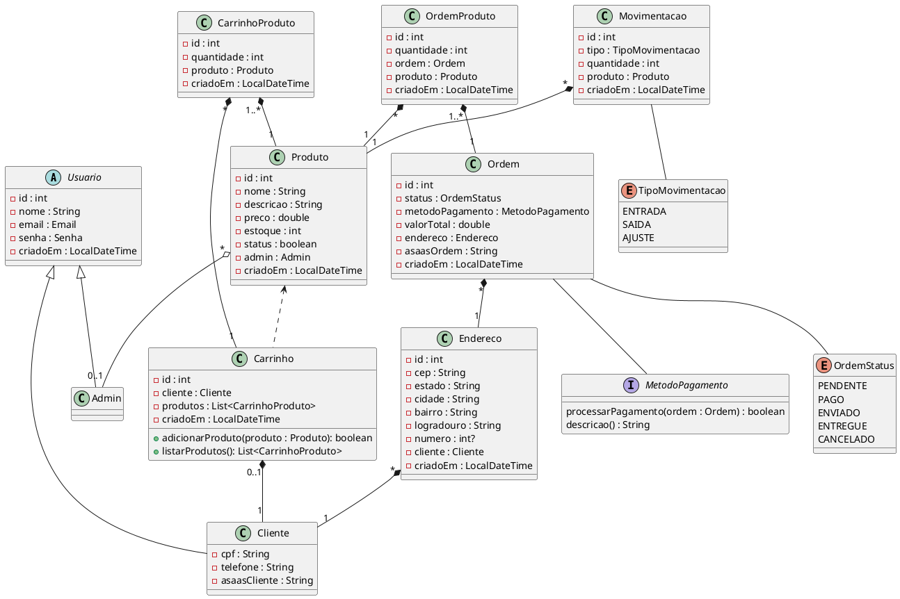

# Game On

Projeto final em Java na matéria de POO do curso de Ciência da Computação.

O objetivo desse projeto é realizar um pequeno e-commerce de artigos esportivos. As principais funcionalidades são: Como administrador, poder manter produtos, controle de estoque e análise de produtos mais vendidas. Como cliente, poder visualizar e filtrar produtos, adicionar itens no carrinho e realizar a compra desses itens.

### Regras de Negócio

Login de administradores para

- Controle de produtos
- Controle de Estoque
- Análise de produtos mais vendidas

Login de clientes para

- Visualizar e filtrar produtos
- Adicionar produtos no carrinho e realizar compras

### Diagrama Entidade Relacionamento

```sql
create database gameon;

use gameon;

create table usuario (
	id int unsigned primary key auto_increment,
    nome varchar(255) not null,
    email varchar(255) not null,
    senha varchar(255) not null,
    criadoEm timestamp not null default current_timestamp
);

create table admin (
	id int unsigned primary key,
    foreign key (id) references usuario (id)
);

create table produto (
	id int unsigned primary key auto_increment,
    nome varchar(255) not null,
    descricao varchar(255) not null,
    preco double not null,
    estoque int unsigned not null,
    status bool not null,
    adminId int unsigned,
    criadoEm timestamp not null default current_timestamp,
    foreign key (adminId) references admin (id) on delete set null
);

create table cliente (
	id int unsigned primary key,
    cpf varchar(255) not null unique,
    telefone varchar(255) not null unique,
    asaasCliente varchar(255) not null unique,
    foreign key (id) references usuario (id)
);

create table endereco (
	id int unsigned primary key auto_increment,
    logradouro varchar(255) not null,
    numero int,
    bairro varchar(255) not null,
    cidade varchar(255) not null,
    cep varchar(255) not null,
    estado varchar(255) not null,
    clienteId int unsigned not null,
    criadoEm timestamp not null default current_timestamp,
    foreign key (clienteId) references cliente (id) on delete cascade
);

create table carrinho_produto (
	produtoId int unsigned not null,
    clienteId int unsigned not null,
    quantidade int unsigned not null,
    criadoEm timestamp not null default current_timestamp,
    primary key (produtoId, clienteId),
    foreign key (produtoId) references produto (id),
    foreign key (clienteId) references cliente (id)
);

create table ordem (
	id int unsigned primary key auto_increment,
    status enum('PENDENTE', 'PAGO', 'ENVIADO', 'ENTREGUE', 'CANCELADO') default 'PENDENTE',
    metodoPagamento varchar(255) not null,
    valorTotal double not null,
    enderecoId int unsigned not null,
    asaasOrdem varchar(255) not null unique,
    criadoEm timestamp not null default current_timestamp,
    foreign key (enderecoId) references endereco (id)
);

create table ordem_produto (
	ordemId int unsigned not null,
    produtoId int unsigned not null,
    quantidade int unsigned not null,
    criadoEm timestamp not null default current_timestamp,
    primary key (ordemId, produtoId),
    foreign key (ordemId) references ordem (id),
    foreign key (produtoId) references produto (id)
);

create table movimentacao (
	id int unsigned primary key auto_increment,
    tipo enum('SAIDA', 'ENTRADA', 'AJUSTE') not null default 'SAIDA',
    quantidade int unsigned not null,
    produtoId int unsigned not null,
    criadoEm timestamp not null default current_timestamp,
    foreign key (produtoId) references produto (id)
);
```

### Diagrama de Classe


